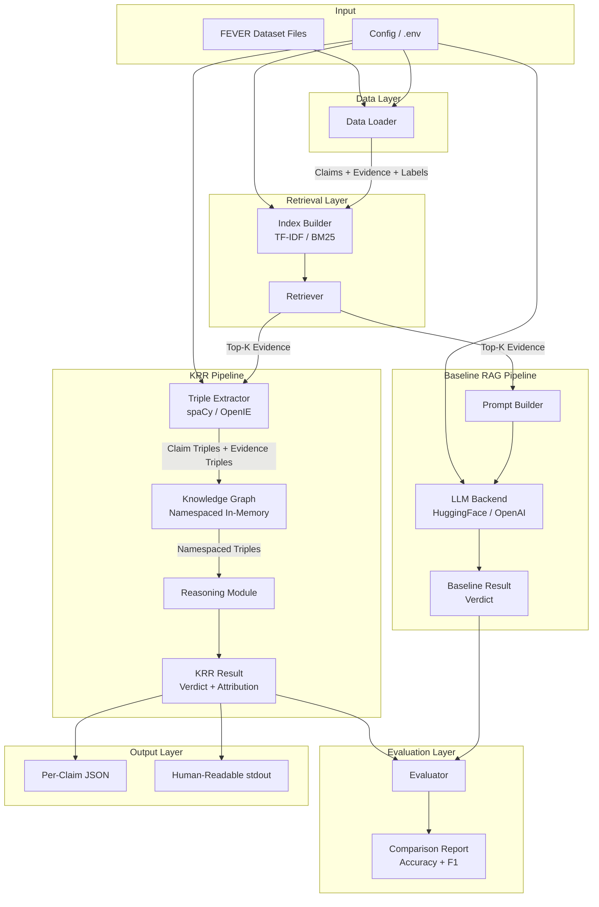

# Design Document

## KRR Fact Verification System

---

## Overview

The Attribution-Aware Knowledge Representation and Reasoning (KRR) Fact Verification System is a Python 3.10+ pipeline that verifies natural language claims against the FEVER dataset using explicit, traceable reasoning. Unlike black-box LLM approaches, the KRR pipeline converts evidence into structured knowledge triples, applies deterministic reasoning rules, and produces a verdict with full attribution to the specific triples that drove the decision.

The system runs two parallel pipelines:

- **KRR Pipeline**: Retrieve → Extract Triples → Build Knowledge Graph → Reason → Verdict + Attribution
- **Baseline RAG Pipeline**: Retrieve → LLM Classify → Verdict

Both pipelines share the same retrieval layer and are evaluated on the same FEVER subset, enabling direct accuracy and interpretability comparison.

### Key Design Goals

1. **Transparency**: Every verdict is traceable to specific evidence triples.
2. **Modularity**: Each component has a clean, typed interface and is independently testable.
3. **Configurability**: All paths, model choices, and hyperparameters are externalized via `.env` / environment variables.
4. **Comparability**: The baseline RAG pipeline uses identical retrieval so differences are attributable to the reasoning approach alone.

---

## Architecture



### Data Flow Summary

1. `DataLoader` reads FEVER files → produces `FeverRecord` objects.
2. `IndexBuilder` indexes the evidence corpus once at startup.
3. For each claim, `Retriever` returns top-K evidence sentences.
4. **KRR path**: `TripleExtractor` converts claim + evidence → triples; `KnowledgeGraph` stores them in namespaced collections; `ReasoningModule` computes counts and assigns verdict with attribution.
5. **Baseline path**: `PromptBuilder` formats claim + evidence; `LLMBackend` returns a verdict string.
6. `Evaluator` collects all results and computes accuracy + per-class F1.
7. `OutputWriter` serializes per-claim results to JSON and/or stdout.

---

## Components and Interfaces

### 2.1 DataLoader (`data/loader.py`)

**Responsibility**: Load and preprocess FEVER dataset files into typed records.

```python
class DataLoader:
    def __init__(self, config: Config) -> None: ...

    def load(self) -> list[FeverRecord]:
        """Load up to config.max_records records from the FEVER dataset.
        Raises FileNotFoundError if dataset path is missing.
        Skips and logs malformed records."""
        ...

    def load_corpus(self) -> list[str]:
        """Return the flat list of all evidence sentences for indexing."""
        ...
```

### 2.2 Retriever (`retrieval/retriever.py`)

**Responsibility**: Build and query a TF-IDF or BM25 index over the evidence corpus.

```python
class Retriever:
    def __init__(self, config: Config) -> None: ...

    def build_index(self, corpus: list[str]) -> None:
        """Index the corpus. Persists to config.index_path if set."""
        ...

    def load_index(self) -> None:
        """Load a pre-built index from config.index_path."""
        ...

    def retrieve(self, claim: str, top_k: int | None = None) -> list[str]:
        """Return top-K evidence sentences for the claim.
        Returns [] and logs warning if no results found."""
        ...
```

### 2.3 TripleExtractor (`knowledge/extractor.py`)

**Responsibility**: Convert natural language sentences into normalized `(subject, relation, object)` triples.

```python
class TripleExtractor:
    def __init__(self, config: Config) -> None: ...

    def extract(self, sentence: str) -> list[Triple]:
        """Extract triples from a single sentence.
        Returns [] for sentences that yield no triples."""
        ...

    def extract_batch(self, sentences: list[str]) -> list[list[Triple]]:
        """Extract triples from multiple sentences."""
        ...
```

### 2.4 KnowledgeGraph (`knowledge/graph.py`)

**Responsibility**: Store triples in namespaced collections with deduplication, querying, and JSON serialization.

```python
class KnowledgeGraph:
    def __init__(self) -> None: ...

    def add_triple(self, triple: Triple, namespace: str) -> None:
        """Add a triple to the given namespace. Deduplicates exact matches."""
        ...

    def get_triples(
        self,
        namespace: str | None = None,
        subject: str | None = None,
        relation: str | None = None,
    ) -> list[Triple]:
        """Query triples by namespace, subject, or relation (combinable)."""
        ...

    def to_dict(self) -> dict:
        """Serialize to a JSON-compatible dict."""
        ...

    @classmethod
    def from_dict(cls, data: dict) -> "KnowledgeGraph":
        """Deserialize from a JSON-compatible dict."""
        ...
```

### 2.5 ReasoningModule (`reasoning/reasoner.py`)

**Responsibility**: Compare claim triples against evidence triples and assign a verdict with attribution.

```python
class ReasoningModule:
    def reason(
        self,
        claim_triples: list[Triple],
        evidence_triples: list[Triple],
    ) -> ReasoningResult:
        """Compute support/refute/irrelevant counts and assign verdict."""
        ...
```

### 2.6 KRRPipeline (`main.py` / `pipeline/krr.py`)

**Responsibility**: Orchestrate the full KRR pipeline for a single claim.

```python
class KRRPipeline:
    def __init__(
        self,
        retriever: Retriever,
        extractor: TripleExtractor,
        reasoner: ReasoningModule,
        config: Config,
    ) -> None: ...

    def run(self, claim: str) -> KRRResult:
        """Run the full pipeline. Returns NOT ENOUGH INFO on any unhandled exception."""
        ...
```

### 2.7 BaselinePipeline (`baseline/pipeline.py`)

**Responsibility**: Retrieve evidence and classify via LLM without explicit reasoning.

```python
class BaselinePipeline:
    def __init__(
        self,
        retriever: Retriever,
        llm_backend: LLMBackend,
        config: Config,
    ) -> None: ...

    def run(self, claim: str) -> BaselineResult:
        """Retrieve evidence, build prompt, call LLM, parse verdict."""
        ...
```

### 2.8 LLMBackend (`baseline/llm.py`)

**Responsibility**: Abstract interface over HuggingFace and OpenAI backends.

```python
class LLMBackend(Protocol):
    def classify(self, prompt: str) -> str:
        """Submit prompt and return raw LLM response string."""
        ...

class HuggingFaceLLM:
    def classify(self, prompt: str) -> str: ...

class OpenAILLM:
    def classify(self, prompt: str) -> str: ...

class MockLLM:
    """Configurable mock for testing."""
    def classify(self, prompt: str) -> str: ...
```

### 2.9 Evaluator (`evaluation/evaluator.py`)

**Responsibility**: Compute accuracy and per-class F1 for both pipelines and produce a comparison report.

```python
class Evaluator:
    def evaluate(
        self,
        krr_results: list[KRRResult],
        baseline_results: list[BaselineResult],
        ground_truth: list[str],
    ) -> EvaluationReport:
        """Compute metrics and return structured report."""
        ...

    def save_report(self, report: EvaluationReport, path: str) -> None:
        """Write report to file and print to stdout."""
        ...
```

### 2.10 Config (`config.py`)

**Responsibility**: Load and validate all configuration from `.env` and environment variables.

```python
class Config:
    fever_dataset_path: str
    evidence_corpus_path: str
    retrieval_top_k: int
    nlp_engine: Literal["spacy", "openie"]
    llm_backend: Literal["huggingface", "openai"]
    llm_api_key: str | None
    eval_output_path: str
    max_records: int | None
    index_path: str | None

    @classmethod
    def from_env(cls) -> "Config":
        """Load from .env file and environment variables.
        Raises ConfigError if required keys are missing."""
        ...
```

---

## Data Models

### 3.1 Triple

The atomic unit of structured knowledge.

```python
from dataclasses import dataclass

@dataclass(frozen=True)
class Triple:
    subject: str    # normalized lowercase, stripped
    relation: str   # normalized lowercase, stripped
    object: str     # normalized lowercase, stripped

    def to_canonical_string(self) -> str:
        """Return 'subject|relation|object' for round-trip parsing."""
        return f"{self.subject}|{self.relation}|{self.object}"

    @classmethod
    def from_canonical_string(cls, s: str) -> "Triple":
        parts = s.split("|", 2)
        if len(parts) != 3:
            raise ValueError(f"Invalid canonical triple string: {s!r}")
        return cls(subject=parts[0], relation=parts[1], object=parts[2])

    def to_dict(self) -> dict[str, str]:
        return {"subject": self.subject, "relation": self.relation, "object": self.object}

    @classmethod
    def from_dict(cls, d: dict) -> "Triple":
        return cls(subject=d["subject"], relation=d["relation"], object=d["object"])
```

**Normalization invariant**: All fields are lowercase and stripped of leading/trailing whitespace at construction time. The `TripleExtractor` enforces this before returning any `Triple`.

### 3.2 FeverRecord

One record from the FEVER dataset.

```python
@dataclass
class FeverRecord:
    claim: str
    evidence: list[str]          # list of evidence sentences
    label: str                   # "SUPPORTS" | "REFUTES" | "NOT ENOUGH INFO"
    record_index: int            # original index in dataset file
```

### 3.3 KnowledgeRecord

A triple annotated with its source namespace and provenance.

```python
@dataclass
class KnowledgeRecord:
    triple: Triple
    namespace: str               # "claim" | "evidence"
    source_sentence: str         # the sentence the triple was extracted from
```

### 3.4 ReasoningResult

Output of the ReasoningModule for a single claim.

```python
@dataclass
class ReasoningResult:
    support_count: int
    refute_count: int
    irrelevant_count: int
    verdict: Literal["SUPPORTS", "REFUTES", "NOT ENOUGH INFO"]
    attribution: list[Triple]    # evidence triples that drove the verdict
```

### 3.5 KRRResult

Full structured output of the KRR pipeline for one claim.

```python
@dataclass
class KRRResult:
    claim: str
    retrieved_evidence: list[str]
    claim_triples: list[Triple]
    evidence_triples: list[Triple]
    support_count: int
    refute_count: int
    irrelevant_count: int
    verdict: Literal["SUPPORTS", "REFUTES", "NOT ENOUGH INFO"]
    attribution: list[Triple]
    error: str | None            # set if a pipeline stage raised an exception
```

### 3.6 BaselineResult

Output of the Baseline RAG pipeline for one claim.

```python
@dataclass
class BaselineResult:
    claim: str
    retrieved_evidence: list[str]
    prompt: str
    verdict: Literal["SUPPORTS", "REFUTES", "NOT ENOUGH INFO"]
    raw_llm_response: str
    error: str | None
```

### 3.7 EvaluationReport

Aggregated metrics for both pipelines.

```python
@dataclass
class EvaluationReport:
    total_claims: int
    skipped_claims: int
    label_distribution: dict[str, int]   # {"SUPPORTS": N, "REFUTES": N, "NOT ENOUGH INFO": N}

    krr_accuracy: float
    krr_f1: dict[str, float]             # per-label F1

    baseline_accuracy: float
    baseline_f1: dict[str, float]        # per-label F1
```

### 3.8 KnowledgeGraph Internal Structure

```python
# Internal storage: namespace → set of KnowledgeRecord
_store: dict[str, list[KnowledgeRecord]]

# Deduplication key: (namespace, triple.subject, triple.relation, triple.object)
```

---

## Module-Level Design

### 4.1 Data Loading and Preprocessing

**FEVER dataset format**: JSONL files where each line is a JSON object with fields `id`, `claim`, `label`, and `evidence` (a nested list of Wikipedia sentence references).

**Preprocessing steps**:
1. Open the FEVER JSONL file line by line.
2. Parse each line as JSON; on `json.JSONDecodeError` or missing required fields, log a warning with the record index and skip.
3. Flatten the nested evidence structure into a list of sentence strings.
4. Normalize the label to uppercase (`SUPPORTS`, `REFUTES`, `NOT ENOUGH INFO`).
5. Stop after `max_records` records if configured.

**Corpus construction**: The evidence corpus for indexing is the union of all evidence sentences across all loaded records, deduplicated.

### 4.2 Evidence Retrieval

**TF-IDF implementation** (default): Uses `sklearn.feature_extraction.text.TfidfVectorizer` + cosine similarity via `sklearn.metrics.pairwise.cosine_similarity`.

**BM25 implementation**: Uses the `rank_bm25` library (`BM25Okapi`).

**Index persistence**: The built index is optionally pickled to `config.index_path`. On startup, if the file exists, it is loaded instead of rebuilding.

**Retrieval algorithm**:
```
1. Tokenize/vectorize the query claim.
2. Score all corpus sentences against the query.
3. Return the top-K sentences by score (descending).
4. If all scores are zero, return [] and log a warning.
```

**Performance**: TF-IDF cosine similarity over a 50K-sentence corpus completes in < 100ms on a standard laptop. BM25 is similarly fast for this scale.

### 4.3 Triple Extraction

**spaCy path** (default):
- Load `en_core_web_sm` (or configurable model).
- For each sentence, run the dependency parser.
- Extract subject-verb-object triples using dependency labels: `nsubj`/`nsubjpass` → subject, root verb → relation, `dobj`/`attr`/`prep+pobj` → object.
- Compound nouns and adjectival modifiers are included in the span text.

**Stanford OpenIE path** (optional):
- Invoke the Stanford CoreNLP server via `stanza` or the `openie` Python wrapper.
- Parse the returned triple list directly.

**Normalization** (applied to both paths):
```python
def normalize(text: str) -> str:
    return text.strip().lower()
```

Applied to subject, relation, and object before constructing a `Triple`.

**Canonical string format**: `"subject|relation|object"` — pipe-delimited, no escaping needed for typical NLP output. The `from_canonical_string` method splits on the first two pipes only (`split("|", 2)`), so objects containing pipes are preserved.

### 4.4 Knowledge Graph

**Namespace design**: Two standard namespaces — `"claim"` and `"evidence"`. Custom namespaces are supported for extensibility.

**Deduplication**: A `set` of `(subject, relation, object)` tuples per namespace tracks seen triples. `add_triple` is a no-op if the triple already exists in the namespace.

**Query interface**:
- `get_triples()` — all triples across all namespaces
- `get_triples(namespace="claim")` — all claim triples
- `get_triples(subject="albert einstein")` — all triples with that subject
- `get_triples(namespace="evidence", relation="born in")` — filtered by both

**JSON serialization format**:
```json
{
  "namespaces": {
    "claim": [
      {"subject": "...", "relation": "...", "object": "...", "source_sentence": "..."}
    ],
    "evidence": [...]
  }
}
```

### 4.5 Reasoning Module

**Algorithm**:

```
Given:
  claim_triples: list[Triple]
  evidence_triples: list[Triple]

If claim_triples is empty OR evidence_triples is empty:
  return ReasoningResult(0, 0, 0, "NOT ENOUGH INFO", [])

For each evidence_triple E:
  Find matching claim triples where E.subject == C.subject AND E.relation == C.relation:
    If E.object == C.object:
      → support_count += 1; add E to supporting_triples
    Else:
      → refute_count += 1; add E to refuting_triples
  If no claim triple shares subject+relation with E:
    → irrelevant_count += 1

Verdict assignment:
  if support_count > refute_count and support_count > 0:
    verdict = "SUPPORTS"
    attribution = supporting_triples
  elif refute_count > support_count and refute_count > 0:
    verdict = "REFUTES"
    attribution = refuting_triples
  else:
    verdict = "NOT ENOUGH INFO"
    attribution = []
```

**Tie-breaking**: When `support_count == refute_count > 0`, the verdict is `NOT ENOUGH INFO` (neither condition is strictly greater).

### 4.6 Baseline RAG Pipeline

**Prompt template**:
```
You are a fact-checking assistant. Given the following claim and evidence, 
classify the claim as one of: SUPPORTS, REFUTES, NOT ENOUGH INFO.

Claim: {claim}

Evidence:
{evidence_sentences_numbered}

Respond with exactly one of: SUPPORTS, REFUTES, NOT ENOUGH INFO
```

**Verdict parsing**: Search the LLM response for the first occurrence of `SUPPORTS`, `REFUTES`, or `NOT ENOUGH INFO` (case-insensitive). If none found, return `NOT ENOUGH INFO` and log a warning.

**HuggingFace backend**: Uses `transformers.pipeline("text-generation", model=config.hf_model_name)` with `max_new_tokens=20`.

**OpenAI backend**: Uses `openai.ChatCompletion.create` with `model=config.openai_model`, `temperature=0`, `max_tokens=20`.

### 4.7 Evaluator

**Metrics computation**: Uses `sklearn.metrics.accuracy_score` and `sklearn.metrics.f1_score(average=None, labels=VERDICT_LABELS)`.

**Invalid verdict handling**: Any verdict not in `{"SUPPORTS", "REFUTES", "NOT ENOUGH INFO"}` is treated as a wrong prediction (mapped to a sentinel value that never matches ground truth) and logged.

**Report format** (stdout):
```
=== Evaluation Report ===
Total claims: 1000 | Skipped: 3
Label distribution: SUPPORTS=334, REFUTES=333, NOT ENOUGH INFO=333

Pipeline          | Accuracy | F1-SUPPORTS | F1-REFUTES | F1-NEI
------------------|----------|-------------|------------|-------
KRR               |   0.712  |    0.731    |   0.698    | 0.706
Baseline RAG      |   0.681  |    0.703    |   0.665    | 0.674
```

### 4.8 Configuration Schema

| Key | Type | Required | Default | Description |
|-----|------|----------|---------|-------------|
| `FEVER_DATASET_PATH` | `str` | ✓ | — | Path to FEVER JSONL file |
| `EVIDENCE_CORPUS_PATH` | `str` | ✓ | — | Path to evidence corpus file |
| `RETRIEVAL_TOP_K` | `int` | — | `5` | Number of evidence sentences to retrieve |
| `NLP_ENGINE` | `str` | — | `"spacy"` | `"spacy"` or `"openie"` |
| `LLM_BACKEND` | `str` | — | `"huggingface"` | `"huggingface"` or `"openai"` |
| `LLM_API_KEY` | `str` | cond. | — | Required when `LLM_BACKEND=openai` |
| `HF_MODEL_NAME` | `str` | — | `"google/flan-t5-base"` | HuggingFace model identifier |
| `OPENAI_MODEL` | `str` | — | `"gpt-3.5-turbo"` | OpenAI model name |
| `EVAL_OUTPUT_PATH` | `str` | ✓ | — | Path for evaluation report output |
| `MAX_RECORDS` | `int` | — | `None` (all) | Max FEVER records to load |
| `INDEX_PATH` | `str` | — | `None` | Path to pre-built retrieval index |
| `SPACY_MODEL` | `str` | — | `"en_core_web_sm"` | spaCy model name |
| `JSON_OUTPUT_PATH` | `str` | — | `None` | Path for per-claim JSON output |

---

## Correctness Properties

*A property is a characteristic or behavior that should hold true across all valid executions of a system — essentially, a formal statement about what the system should do. Properties serve as the bridge between human-readable specifications and machine-verifiable correctness guarantees.*

